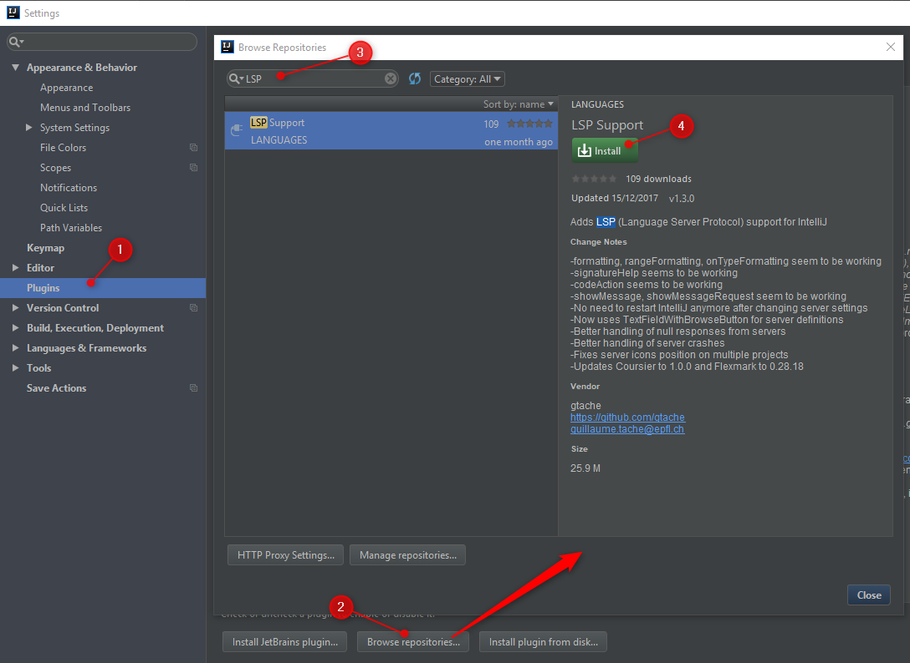
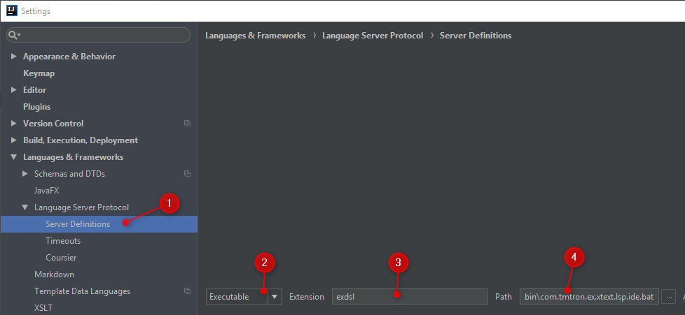
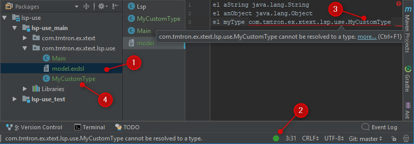

# Testproject for Xtext LSP support

The repository contains 2 projects:

* `com.tmtron.ex.xtext.lsp.parent`: contains the (Eclipse) xtext-projects, including the language server
* `lsp-use`: a simple (IntelliJ IDEA) project that uses the language and language server

## Building the DSL: 

* just execute `gradlew build` in `com.tmtron.ex.xtext.lsp.parent/`
* the LSP archive will be extracted to this directory: 
`com.tmtron.ex.xtext.lsp.parent/com.tmtron.ex.xtext.lsp.ide/build/lsp/com.tmtron.ex.xtext.lsp.ide-1.0.0-SNAPSHOT/`

## Using the DSL project in IntelliJ Idea:

* Import the `lsp-use` project: File - New - Import existing sources 
* Install the [intellij-lsp plugin](https://github.com/gtache/intellij-lsp)

* After restarting the IDE, configure the plugin
  
1. Go to `File` - `Settings` - `Server Definitions`
2. set the type to `Executable`
3. set the extension to `exdsl`
4. set the path to the start-script: e.g. `xxx/text-lsp/com.tmtron.ex.xtext.lsp.parent/com.tmtron.ex.xtext.lsp.ide/build/lsp/com.tmtron.ex.xtext.lsp.ide-1.0.0-SNAPSHOT/bin/com.tmtron.ex.xtext.lsp.ide.bat`
* when you now open the model file, the language server will be started automatically:

1. Open the model file
2. The green dot in the status-bar belongs to the `intellij-lsp plugin` (you can click it to open a pop-up menu)
3. Note, that the `MyCustomType` class is not recognized by the language server
4. The `MyCustomType` class is defined in the `lsp-use` project

Note, that the error is just shown in the editor. The DSL generation works fine.


Links:

* Xtext forum discussion: [LSP: resolving types](https://www.eclipse.org/forums/index.php/m/1780255/#msg_1780255)
* xtext-core issue #159: [LanguageServer Provide basic java project concept](https://github.com/eclipse/xtext-core/issues/159)
* xtext-core issue #589:[LSP getImplicitImports isn't working as expected](https://github.com/eclipse/xtext-core/issues/589)

### Update 1
As suggested in this forum post:
https://www.eclipse.org/forums/index.php?t=rview&goto=1780283#msg_1780283
added `META-INF/services/org.eclipse.xtext.ISetup` has been added.

The `intellij-lsp plugin` still does not work. Error from the idea log:

```
2018-01-20 14:36:16,591 [  30789]   INFO - m.github.gtache.lsp.PluginMain - Opened model.exdsl 
2018-01-20 14:36:16,594 [  30792]   INFO - m.github.gtache.lsp.PluginMain - Instantiating wrapper for exdsl : file:///D:/projects/learning/xtext-lsp/lsp-use/ 
2018-01-20 14:36:16,619 [  30817]   INFO - m.github.gtache.lsp.PluginMain - Adding file model.exdsl 
2018-01-20 14:36:16,624 [  30822]   INFO - rocessStreamConnectionProvider - Starting server process with commands WrappedArray(D:\projects\learning\xtext-lsp\com.tmtron.ex.xtext.lsp.parent\com.tmtron.ex.xtext.lsp.ide\build\lsp\com.tmtron.ex.xtext.lsp.ide-1.0.0-SNAPSHOT\bin\com.tmtron.ex.xtext.lsp.ide.bat) and workingDir D:/projects/learning/xtext-lsp/lsp-use 
2018-01-20 14:36:16,627 [  30825]   INFO - rocessStreamConnectionProvider - Server process started java.lang.ProcessImpl@33141ee8 
2018-01-20 14:36:19,440 [  33638]   WARN - pper.LanguageServerWrapperImpl - org.eclipse.lsp4j.jsonrpc.ResponseErrorException: Internal error. 
java.util.concurrent.ExecutionException: org.eclipse.lsp4j.jsonrpc.ResponseErrorException: Internal error.
	at java.util.concurrent.CompletableFuture.reportGet(CompletableFuture.java:357)
	at java.util.concurrent.CompletableFuture.get(CompletableFuture.java:1915)
	at com.github.gtache.lsp.client.languageserver.wrapper.LanguageServerWrapperImpl.getServerCapabilities(LanguageServerWrapperImpl.scala:105)
	at com.github.gtache.lsp.client.languageserver.wrapper.LanguageServerWrapperImpl.connect(LanguageServerWrapperImpl.scala:165)
	at com.github.gtache.lsp.PluginMain$.$anonfun$editorOpened$4(PluginMain.scala:127)
	at com.github.gtache.lsp.PluginMain$.$anonfun$editorOpened$4$adapted(PluginMain.scala:109)
	at scala.Option.foreach(Option.scala:257)
	at com.github.gtache.lsp.PluginMain$.$anonfun$editorOpened$3(PluginMain.scala:109)
	at com.intellij.openapi.application.impl.ApplicationImpl$1.run(ApplicationImpl.java:315)
	at java.util.concurrent.Executors$RunnableAdapter.call(Executors.java:511)
	at java.util.concurrent.FutureTask.run(FutureTask.java:266)
	at java.util.concurrent.ThreadPoolExecutor.runWorker(ThreadPoolExecutor.java:1142)
	at java.util.concurrent.ThreadPoolExecutor$Worker.run(ThreadPoolExecutor.java:617)
	at java.lang.Thread.run(Thread.java:745)
Caused by: org.eclipse.lsp4j.jsonrpc.ResponseErrorException: Internal error.
	at org.eclipse.lsp4j.jsonrpc.RemoteEndpoint.lambda$request$1(RemoteEndpoint.java:121)
	at org.eclipse.lsp4j.jsonrpc.RemoteEndpoint.handleResponse(RemoteEndpoint.java:162)
	at org.eclipse.lsp4j.jsonrpc.RemoteEndpoint.consume(RemoteEndpoint.java:149)
	at org.eclipse.lsp4j.jsonrpc.json.StreamMessageProducer.handleMessage(StreamMessageProducer.java:149)
	at org.eclipse.lsp4j.jsonrpc.json.StreamMessageProducer.listen(StreamMessageProducer.java:77)
	at org.eclipse.lsp4j.jsonrpc.json.ConcurrentMessageProcessor.run(ConcurrentMessageProcessor.java:84)
	... 5 more
2018-01-20 14:36:19,443 [  33641]   WARN - pper.LanguageServerWrapperImpl - Capabilities are null for exe : path D:\projects\learning\xtext-lsp\com.tmtron.ex.xtext.lsp.parent\com.tmtron.ex.xtext.lsp.ide\build\lsp\com.tmtron.ex.xtext.lsp.ide-1.0.0-SNAPSHOT\bin\com.tmtron.ex.xtext.lsp.ide.bat args :  
```